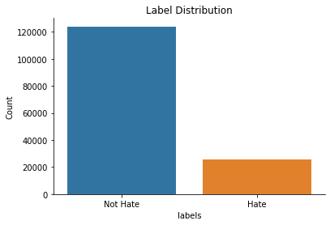

# hate-speech-detection

## Overview 

The Goal of this project was to identify hateful meme. The goal is to build a deep learning model that takes a content which consists of image and text as input, and then classify it as hateful/not-hateful. Meaning of any content can be understood by considering the combination of both text and image. Therefore, the text ingested into the model would be related to the image.

## Dataset

The dataset was collected from Kaggle and it contains 150,000 tweets, each one of them containing text and an image. Twitter API was used to gather real-time tweets from September 2018 until February 2019, selecting the ones containing any of the 51 Hatebase terms that are more common in hate speech tweets. Out of these selected tweets only those were kept that contains an image.

### Labelling

A tweet was annotated as hateful/non hateful using Amazon Mechanical Turk. Three annotators were assigned the task of annotating the tweet into 6 categories i.e. 0 - NotHate, 1 - Racist, 2 - Sexist, 3 - Homophobe, 4 - Religion, 5 - OtherHate. To make this problem simpler, we created two classes from these six classes. NotHate as class 0 and rest of the classes as class 1. Also since there are 3 annotators, we took mode of the three annotators to label a tweet as hateful/not hateful.

### Distribution

On performing some EDA, it was evident that dataset is imbalanced and number of not hateful tweets is 4 times greater than the number of hateful tweets.

We tried to handled this imbalance by weighing the under sample class more heavily while training the model.

## Preprocessing 

Since a tweet contains both image and text data, the model used to classify the tweets initially processes image and text data separately. 

### Image processing

To process the image following steps were taken

- Image was read using opencv.
- Dimensions of image present in the dataset is not fixed. Therefore, we resized all the image to dimension of 224x224. We chose this dimension as Resnet18 expects the input to have same dimension.
- Since opencv read image in BGR color code but Resent18 takes RGB color code as input, therefore we changed the color code of all the image from BGR to RGB 
- Few random image augmentations like rotation with 10% probability, random brightness and normalization of input image was performed to improve generalizability of the model
- We then fed the image to pertained Resnet18 model which gives us an embedding of size 1000

### Text processing

To process the text following steps were taken

- Text was initially tokenized using spacy
- Tokenized text was then lemmatized and the lemmatized token was then combined with a space as a separator for each token
- Lemmatized token text was then fed  
we used ResNet18 model to process the image and word  embedding from hugging face to process text.

## Next Steps
